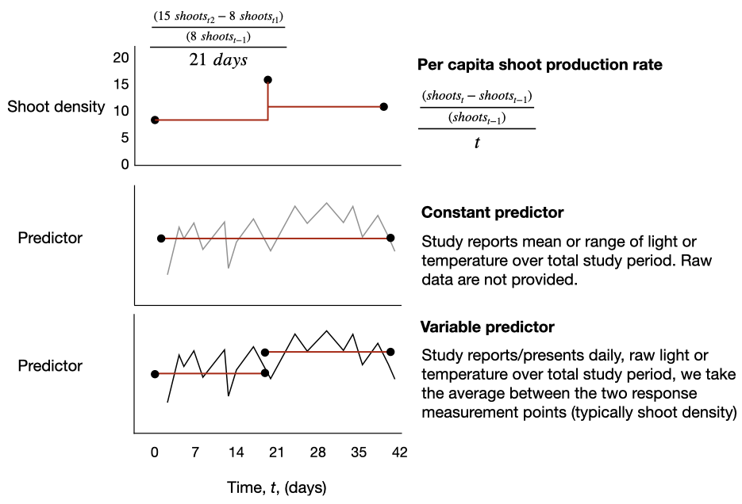

```{r, eval=FALSE, echo=FALSE}
rmarkdown::render(input = here('R', 'Supplementary_Figures.Rmd'), output_dir = "drafts")
```

{width=16.9cm}
**Figure S1.** Example of the ways in which data were extracted when (a) shoot 
density time-series were provided, (b) a single value of the predictors 
(temperature and/or light) was provided over the duration of all response measurements, 
and (c) raw data time-series were provided for of predictors.
The data were then summarised over the time-scale corresponding to the duration 
over which responses were measured. In all cases rates of per-capita shoot 
production were standardised to per day.  

<br>

{width=16.9cm}

**Figure S2.**
(a) Predicted fits of population growth rate by eelgrass, 
*r* (day^-1^), in relation to light at different temperatures, shown (in ˚C) 
above each panel. The vertical dashed lines denote the daily light integral, *DLI~r=rmax~*, 
at which population growth is maximal for a given temperature. The narrow temperature
bins between 25 and 30˚C highlight the temperatures over which *DLI~r=rmax~* increases
rapidly. The shaded areas are 95% simultaneous confidence intervals from model fits. 
(b) The relationship between *DLI~r=rmax~* and temperature, as estimated from mean GAMM fits. Uncertainty around the *DLI~r=rmax~* estimate, in grey, indicates the 2.5% and 97.5% quantiles of *DLI~r=rmax~* estimated from simulating 1000 draws of thermal performance curves across from the GAMM posterior distribution. 
To reduce the influence from high uncertainty at the tails of the predictor data ranges, we only estimated *DLI~r=rmax~* for DLI < 26 mol m^-2^ day^-1^ and temperature > 8˚C. 
Colours in (b) correspond to the temperature bins in (a).

<br>

{width=16.9cm}

**Figure S3.**
(a) Predicted fits of population growth rate by eelgrass, 
*r* (day^-1^), in relation to temperature at different light levels, shown (in mol m^-2^ day^-1^) 
above each panel. The vertical dashed lines denote the temperature, *T~r=rmax~*, 
at which population growth is maximal for a given light level. The narrow light
bins between 10 and 15 mol m^-2^ day^-1^ highlight the light bins over which *T~r=rmax~* 
increases rapidly. The shaded areas are 95% simultaneous confidence intervals from model fits. 
(b) The relationship between *T~r=rmax~* and the daily light integral, as estimated from mean GAMM fits. Uncertainty around the *T~r=rmax~* estimate, in grey, indicates the 2.5% and 97.5% quantiles of *T~r=rmax~* estimated from simulating 1000 draws of thermal performance curves across from the GAMM posterior distribution. To reduce the influence from high uncertainty at the tails of the predictor data ranges, we only estimated *T~r=rmax~* for DLI < 26 mol m^-2^ day^-1^ and temperature > 8˚C. 
Colours in (b) correspond to the daily light integral bins in (a). 


